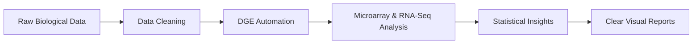

  <h1>🧬 AI & Omics Research Internship 2025</h1>
  
<b>Advanced Bioinformatics Pipelines & Data Science Portfolio</b>

  
  
  
  
  

---

## 🌟 Introduction
Welcome to my research repository for the **AI and Omics Research Internship (2025)**. This project highlights my work in bridging the gap between Biology and Computer Science. Using the R programming language and specialized bioinformatics tools, I developed several pipelines to process, analyze, and visualize complex genomic data.

---

## 🛰️ Research Pipeline Flow
To help you understand my work, here is a simple flowchart of the biological data analysis process I implemented:

---

## 🚀 Key Research Areas
During this internship, I focused on several high-impact areas of bioinformatics:

### ⚙️ Data Engineering & Environment Setup
Before starting any analysis, it is crucial to have clean data. I specialized in:
*   **Automated Workspace Management**: Building R scripts that automatically create organized folder structures.
*   **Deep Data Cleaning**: Using the `tidyverse` to fix missing values and prepare medical records for analysis.
*   **Implementation**: [`Data_Cleaning_Script.R`](file:///home/fanaeahmed/AI_Omics_Internship_2025/FanaeAhmed_class_Ib.R)

### 📊 Differential Gene Expression (DGE) Automation
Identifying which genes are active or inactive in a disease is a major part of bioinformatics. I developed:
*   **Automatic Gene Classification**: A system that reads data and automatically labels genes as "Upregulated" (active) or "Downregulated" (inactive).
*   **Scalable Analysis**: Logic that can handle multiple datasets quickly without manual editing.
*   **Implementation**: [`DGE_Automation_System.R`](file:///home/fanaeahmed/AI_Omics_Internship_2025/FanaeAhmed_Class%202_Assignment.R)

### 🔬 Multi-Omics Analysis (Cancer & PCOS Research)
I applied my skills to real-world medical data:
1.  **Microarray Analysis (GSE41258)**: Studied colorectal cancer data using RMA normalization to ensure high-quality results.
    *   **Implementation**: [`Microarray_Pipeline.R`](file:///home/fanaeahmed/AI_Omics_Internship_2025/Fanae_Ahmed_Class_3_Assignment_GSE41258.R)
2.  **RNA-Seq Pipeline (GSE277906)**: Built a complete pipeline using `DESeq2` to study PCOS. This involved advanced techniques like Variance-Stabilizing Transformation (VST).
    *   **Implementation**: [`RNA_Seq_Workflow.R`](file:///home/fanaeahmed/AI_Omics_Internship_2025/RNA_Seq_Preprocessing.R)
3.  **Downstream Visualization**: Created publication-quality Volcano plots and Heatmaps to show the "Top 25" most significant genes.
    *   **Implementation**: [`Statistical_Modeling_Visuals.R`](file:///home/fanaeahmed/AI_Omics_Internship_2025/FanaeAhmed_Class%203C_Assignment.R)

---

## 📂 Project Organization

| File Name | Purpose |
| :--- | :--- |
| `FanaeAhmed_class_Ib.R` | Environment setup and patient data cleaning. |
| `FanaeAhmed_Class 2_Assignment.R` | Automated Gene Classification logic. |
| `Fanae_Ahmed_Class_3_...GSE...R` | Microarray normalization and Quality Control. |
| `RNA_Seq_Preprocessing.R` | Full RNA-Seq analysis using DESeq2. |
| `FanaeAhmed_Class 3C_Assignment.R` | DGE statistics and advanced visualizations. |

---

## 🛠️ Key Skills Used
*   **Programming**: Advanced R & Tidyverse.
*   **Bio-IT**: Bioconductor, DESeq2, Limma, GEOquery.
*   **Data Science**: Feature engineering, normalization (RMA, VST), and PCA.
*   **Communication**: Expert README design and high-quality data visualization.

---

## 🤝 Acknowledgments
I would like to express my sincere gratitude to the **AI and Omics Research Internship Program** for providing the mentorship, datasets, and guidance that made this research possible.

---

<i>Final Research Documentation | Developed by Fana-e-Ahmed</i>

